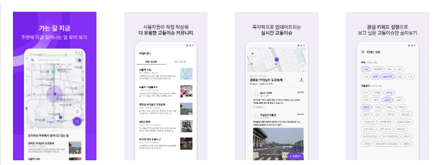
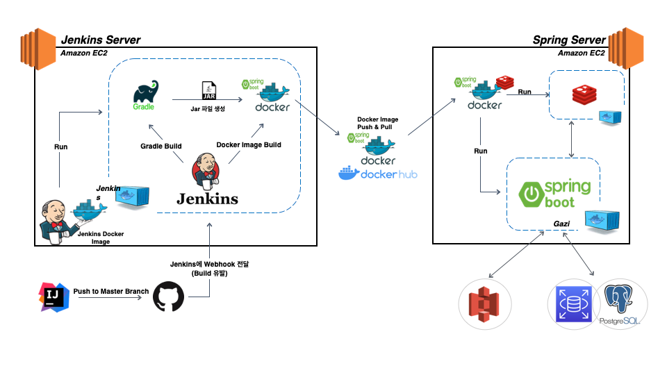

# GAZI

당신이 가는길, 지금 일어나는 모든 교통 이슈 한 눈에 모아보고 시민들의 자유로운 의견을 나눌 수 있는 커뮤니티 서비스
## 주요기능
- 관심 키워드 설정으로 개인화 맞춤 커뮤니티로 원하는 교통 이슈만 빠르게 확인
- 서울 공공데이터 기반 실시간 업데이트 되는 교통 이슈
- 주변에서 일어나는 일 자동 조회

## 사용기술
Java, Spring Boot, InteliJ, gradle, Redis, PostgeSql, JPA, S3, EC2, RDS,

## 아키텍쳐

## ERD

