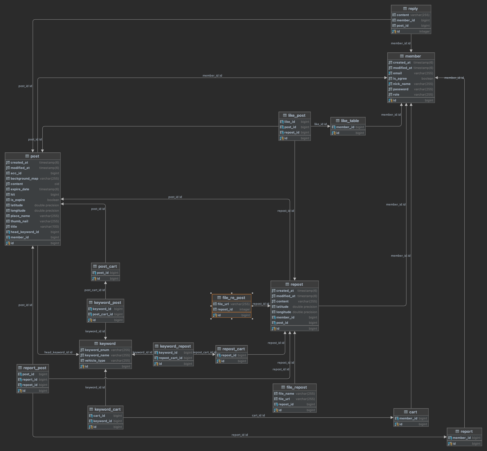

# GAZI
당신이 가는길, 지금 일어나는 모든 교통 이슈 한 눈에 모아보고 시민들의 자유로운 의견을 나눌 수 있는 커뮤니티 서비스
## 주요기능
- 관심 키워드 설정으로 개인화 맞춤 커뮤니티로 원하는 교통 이슈만빠르게 확인
- 서울 공공데이터 기반 실시간 업데이트되는 교통 이슈
- 주변에서 일어나는 일 자동 조회

## 사용기술
Java, Spring Boot, InteliJ, gradle, Redis, PostgeSql, JPA, s3, EC2, RDS, 

- 교통 돌발상황을 한 곳에서 모아보고, 빠르게 이슈를 공유함으로써
  서울 시민들의 원활한 교통수단 이용에 기여할 수 있는 서비스 필요함
- 서울 공모전 출전
- 어플 런칭후 운영까지 해보는 경험 습득

## 아키텍쳐
CI/ CD구현후 업데이트

## ERD

## 트러블 슈팅
